<!-- hero: monochrome ASCII portrait (types in) beside a neofetch-style info panel.
     regenerate portrait from a new photo:
       python scripts/crop_face.py <photo> source-photo.jpg   # wide shots only
       python scripts/prep_photo.py source-photo.jpg
       python scripts/make_ascii_svg.py
     info panel: python scripts/make_info_card.py
     all identity/bio content lives in scripts/profile_config.py -->
<table>
<tr>
<!-- widths are tuned so BOTH cards render to the same height (~410px) and their
     bottoms line up: portrait is 840x875 (aspect 1.0417), card is 480x402
     (0.8375). 394*1.0417 == 490*0.8375. Re-derive these if either SVG's
     intrinsic size changes -- e.g. adding a row to ROWS grows the card. -->
<td valign="top"></td>
<td valign="top"></td>
</tr>
</table>

## Kartik Jain         

<!-- keep this ONE line and plain text: a hyperlink here renders blue+underlined
     and the extra width wraps it onto two lines on a phone. ~45 chars is the
     mobile limit at this font size. -->
**DevOps & AI Engineer · Building Veergati**

<!-- LinkedIn's logo is passed as a base64 data URI on purpose: simple-icons
     dropped the LinkedIn glyph (trademark), so `logo=linkedin` silently renders
     a badge with NO icon. Every logo here is verified to embed an <image>. -->

 

<!-- animated contribution graph: real data, boxes reveal cell by cell
     (regenerated daily by .github/workflows/update-profile-art.yml) -->

