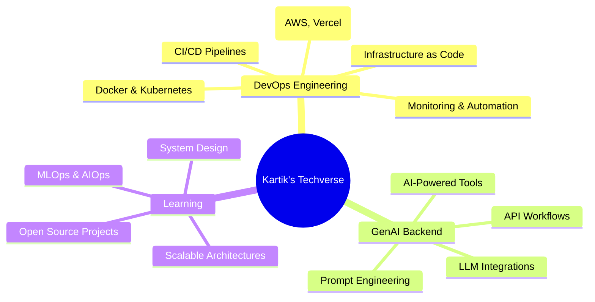

<!-- hero: monochrome ASCII portrait (types in) beside a neofetch-style info
     panel. regenerate portrait: python scripts/prep_photo.py source-photo.jpg &&
     python scripts/make_ascii_svg.py ; info panel: python scripts/make_info_card.py
     all identity/bio content lives in scripts/profile_config.py -->
<table>
<tr>
<td valign="top"></td>
<td valign="top"></td>
</tr>
</table>

## Kartik Jain

**DevOps Engineer · GenAI Backend Builder**

 

<!-- animated contribution graph: real data, boxes reveal cell by cell
     (regenerated daily by .github/workflows/update-profile-art.yml) -->

---

## 👨‍💻 About Me

- 🔭 Currently working on **DevOps automation** and **GenAI-powered backends**
- 🌱 Learning **System Design**, **MLOps & AIOps**, and scalable architectures
- ❓ Ask me about **DevOps, Cloud, Web Development, Problem Solving**
- ⚡ Fun fact: every time I `git pull`, there is a conflict

---

## 🛠️ Tech Stack

<b>🤖 AI & Machine Learning</b>

 

<b>☁️ Cloud & DevOps</b>

 

<b>💻 Frontend Development</b>

 

<b>⚙️ Backend Development</b>

 

---

## 💡 What I'm Up To

---

## 🌟 Let's Connect & Collaborate!

  

 

