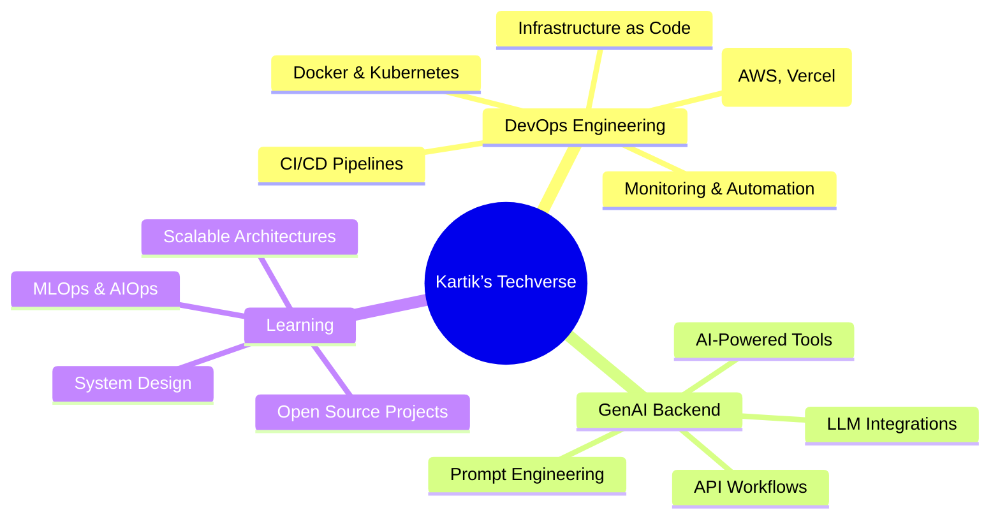

  
 
    

   
    

    
<h1 align="center">                          
  Let's Connect and have a Chat!💬                                                                
</h1>                                   
                   
</h3>      

  
  
  
  
  

    

### 
I'm Kartik Jain, a DevOps Enthusiast. 👨‍💻
  
  

- 🔭 I’m currently working on learning new DevOps skills.  
  

- 🌱 I’m currently learning Full Stack Web Development , Linux , Shell Scripting , Java+DSA !!  
  

- ❓ Ask me about anything related to DevOps, Web Development, Problem Solving, Competetive Coding :)  
  

- ⚡ Fun fact: Everytime I do a git pull & there is a conflict.  
  

   

---

## 🛠️ Tech Stack

<b>🤖 AI & Machine Learning</b>

 

<b>☁️ Cloud & DevOps</b>

 

<b>💻 Frontend Development</b>

 

<b>⚙️ Backend Development</b>

 

---

## 🌟 Let's Connect & Collaborate!

 

 

  

  
  

  

## ⚡ GitHub Stats :    

<!--  -->
 

<!--  -->

 

  

  

 

## 💡 What I'm Up To

```mermaid
%%{init: {'theme':'default', 'themeVariables': { 
  'primaryColor':'#8B5CF6', 
  'primaryTextColor':'#FFFFFF', 
  'primaryBorderColor':'#7C3AED', 
  'lineColor':'#A78BFA', 
  'secondaryColor':'#5EEAD4', 
  'tertiaryColor':'#99F6E4', 
  'background':'#F8FAFC', 
  'mainBkg':'#8B5CF6', 
  'secondBkg':'#5EEAD4', 
  'tertiaryBkg':'#A78BFA'
}}}%%
mindmap
  root((Kartik’s Techverse))
    DevOps Engineering
      CI/CD Pipelines
      Infrastructure as Code
      Docker & Kubernetes
      Cloud Deployment (AWS, Vercel)
      Monitoring & Automation
    GenAI Backend
      LLM Integrations
      API Workflows
      Prompt Engineering
      AI-Powered Tools
    Learning
      System Design
      MLOps & AIOps
      Scalable Architectures
      Open Source Projects

```

 

  

 

